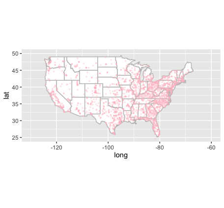
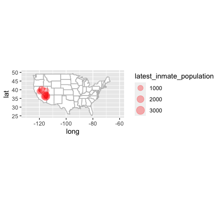

### Note: This report shows summary information from New York Times' COVID-19 data available at this website: [https://github.com/nytimes/covid-19-data](https://github.com/nytimes/covid-19-data)

## 1. Load the prisons data in R

```r 
fac = read_csv('covid-19-data/prisons/facilities.csv')
```

```
# A tibble: 2,639 x 16
   nyt_id facility_name facility_type facility_city facility_county facility_county… facility_state facility_lng facility_lat
   <chr>  <chr>         <chr>         <chr>         <chr>           <chr>            <chr>                 <dbl>        <dbl>
 1 F3EFE… Alex City Wo… Low-security… Alex City     Coosa           01037            Alabama               -86.0         32.9
 2 5B910… Alabama Ther… State rehabi… Columbiana    Shelby          01117            Alabama               -86.6         33.2
 3 02FB1… Bibb Correct… State prison  Brent         Bibb            01007            Alabama               -87.2         32.9
 4 6378F… Birmingham W… State prison  Birmingham    Jefferson       01073            Alabama               -86.8         33.5
 5 EAABF… Bullock Corr… State prison  Bessemer      Bullock         01011            Alabama               -85.7         32.1
 6 D19A2… Camden prison State prison  Camden        Wilcox          01131            Alabama               -87.3         32.0
 7 F80A4… Childersburg… State prison  Childersburg  Talladega       01121            Alabama               -86.4         33.3
 8 F119A… William E. D… State prison  Bessemer      Jefferson       01073            Alabama               -87.2         33.5
 9 41B5B… Draper Corre… State prison  Elmore        Elmore          01051            Alabama               -86.3         32.6
10 9C1D5… Easterling C… State prison  Cilo          Barbour         01005            Alabama               -85.6         31.7
# … with 2,629 more rows, and 7 more variables: latest_inmate_population <dbl>, max_inmate_population_2020 <dbl>,
#   total_inmate_cases <dbl>, total_inmate_deaths <dbl>, total_officer_cases <dbl>, total_officer_deaths <dbl>, note <chr>
```

## 2. Create a base map of the United States.
```r
library(maps)
library(mapdata)

usa = map_data('usa')
states = map_data('state')

usa_base = ggplot(data=states) +
	  geom_polygon(aes(x=long, y=lat, fill=I('white'), group=group), color='gray') +
	  coord_fixed(1.3) +
	  guides(fill=FALSE)
```

<center>
 </img>
</center>

```r
usa_base +
	geom_point(data=fac %>% filter(facility_state=='Nevada'),
	aes(x=facility_lng, y=facility_lat, cex=latest_inmate_population), color='red', alpha=0.3) +
	coord_fixed(xlim=c(-130, -60), ylim=c(25,50), ratio=1.3)
```

<center>
 </img>
</center>